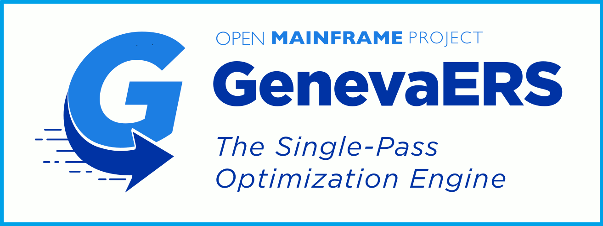
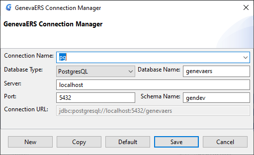
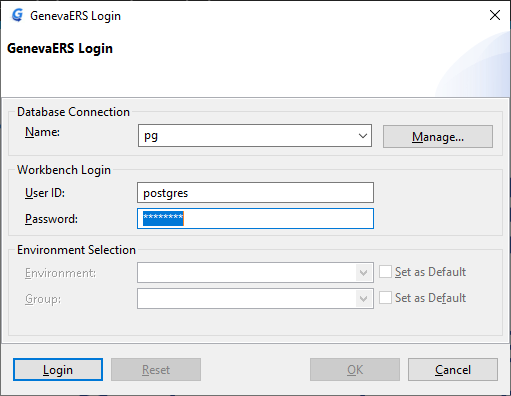
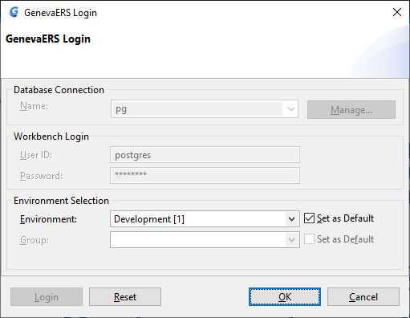

# GenevaERS-WorkBench  
To build  
:gear:  

## Hardware and software requirements

In order to build the Workbench you need the following.

A Java 11 or greater JDK for your platform. For instance from [here](https://adoptopenjdk.net/)

An up to date install of [Maven](https://maven.apache.org/download.cgi) - latest at time of writing is Apache Maven 3.8.4.

An installation of Postgres. [See](https://www.postgresql.org/download/)


## Build, Installation, configuration

Clone the GenevaERS-WorkBench repository from github somewhere on your machine.

Use GitBash or something similar and change to the directory where you cloned the repository.

Before building ensure that a Java JDK and Maven are installed.
Enter the commands below and you should see something similar.

    $ java --version
    openjdk 11.0.10 2021-01-19
    OpenJDK Runtime Environment AdoptOpenJDK (build 11.0.10+9)
    Eclipse OpenJ9 VM AdoptOpenJDK (build openj9-0.24.0, JRE 11 Windows 10 amd64-64-Bit Compressed References 20210120_899 (JIT enabled, AOT enabled)
    OpenJ9   - 345e1b09e
    OMR      - 741e94ea8
    JCL      - 0a86953833 based on jdk-11.0.10+9)

    $ mvn -version
    Apache Maven 3.8.4 (9b656c72d54e5bacbed989b64718c159fe39b537)
    Maven home: C:\maven\apache-maven-3.8.4
    Java version: 11.0.10, vendor: AdoptOpenJDK, runtime: C:\adoptOpenJDK\jdk-11.0.10+9
    Default locale: en_AU, platform encoding: Cp1252
    OS name: "windows 10", version: "10.0", arch: "amd64", family: "windows"

### GenevaERS-WorkBench

To build the workbench for your platform (Linux not tested yet!) enter

    mvn install

Maven will then download the various libraries needed to build the workbench.
This may take some time for the first build. Subsequent builds will be faster.

To rebuild the workbench following code changes or a git pull clean the build first.

    mvn clean
    mvn install

On completion you should see.

    [INFO] Reactor Summary:
    [INFO]
    [INFO] GenevaERS Workbench 4.50.0 ......................... SUCCESS [  0.688 s]
    [INFO] Syntax Checker and Dependency Analysis 1.0.0-SNAPSHOT SUCCESS [ 27.539 s]
    [INFO] COBOL Copybook to LR Converter 1.0.0-SNAPSHOT ...... SUCCESS [  4.388 s]
    [INFO] [aggregator] plugins 4.50.0 ........................ SUCCESS [  0.028 s]
    [INFO] [bundle] Nebula Grid 1.0.0.201311251846 ............ SUCCESS [  5.188 s]
    [INFO] [bundle] Nebula TableCombo Plugin 1.0.0.201311251846 SUCCESS [  0.413 s]
    [INFO] [bundle] GenevaERS Plug-in 4.50.0 .................. SUCCESS [ 13.006 s]
    [INFO] [aggregator] products 4.50.0 ....................... SUCCESS [  0.024 s]
    [INFO] [product] GenevaERS 4.50 ........................... SUCCESS [ 39.977 s]
    [INFO] [aggregator] releng 4.50.0 ......................... SUCCESS [  0.034 s]
    [INFO] [target] target-platform.target 4.50.0 ............. SUCCESS [  0.043 s]
    [INFO] ------------------------------------------------------------------------
    [INFO] BUILD SUCCESS
    [INFO] ------------------------------------------------------------------------
    [INFO] Total time:  02:34 min
    [INFO] Finished at: 2022-01-26T14:38:29+08:00
    [INFO] ------------------------------------------------------------------------

Many thanks to Christoph over at the [Eclipse/Tycho Project](https://github.com/eclipse/tycho) without whose help this build would not exist.

:thinking:  

### PostgreSQL Database Install  
Install PostgreSQL as per its instructions ...  

	Add Environment variable PATH values for both PostgreSQL directories for bin and lib  

Note the admin username and password you create as part of the install to be used later. We used the user *postgres*  
and the password *postgres*.  The database is intended to be a locally run only.
If you are sharing it then apply some more rigourous security measures :-)

Open a command prompt and run the following to ensure that Postgres and the associated psql are installed.

    $ psql --version
    psql (PostgreSQL) 12.4

The from the cloned directory change to the SQL resources as below.
And run psql to create and populate your database. 

    cd plugins/genevagui/resources/
    psql -h localhost -p 5432 -U postgres -v dbname=genevaers -v schemaV=gendev -f runall.sql


    Explanation... 
        psql is the postgres command line app  
        -h the host ip address  
        -p the port number. 5432 is the default at the install  
        -U postgres is the name of the postgres admin user you created at install. Change the name if you chose something different when you installed PostgreSQL.  
        -v dbname=genevaers This creates a script variable called dbname and assigns it the value “genevaers”. That will be the name of the database.  
        -v schemaV=gendev is a script variable and assigns it the value “gendev”. That will be what the schema is named.  
        You can choose something else if you want.
        -f runall.sql Means run this file. This will create the database called genevaers, create the tables needed, perform an initial set up of those tables, install some stored procedures, and create a GenevaERS user called “postgres”.  


## Run the GenevaERS WorkBench

The runable executable generated by the build will be in the directory

    products/com.ibm.safr.we.product/target/products/wb

For Windows continue to 

    win32/win32/x86_64/GenevaERS.exe

For Mac continue to 

    macosx/cocoa/x86_64/Eclipse.app

Run the executable to start the splash screen 




After a few seconds on the first run the connection manager dialog will appear. Note subsquent runs will go straight to the login dialog.




In the GenevaERS Login you need to fill out information to connect to the postgres DB you installed...  
```  
    -    Connection Name is anything you want it to be.
    -    Database Name *genevaers* is what we just created.
    -    Server and port are to connect to Postgres... 
         -	    Server is *localhost*
         -	    Port is *5432*  
    -    Schema Name *gendev* is what we just created.  
    -    Press Save.  
```


You will now have the WorkBench Login Dialog. 

The User ID and password are postgres and postgres (If that is what you chose above). 





Press the Login button to move to the logged in state. 





Press OK and the delights of the Workbench will be yours to savour.
