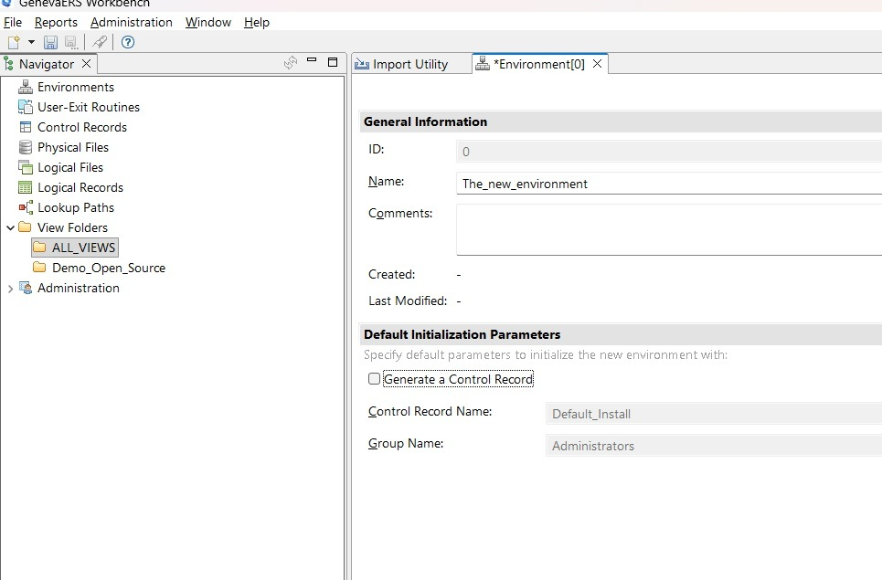
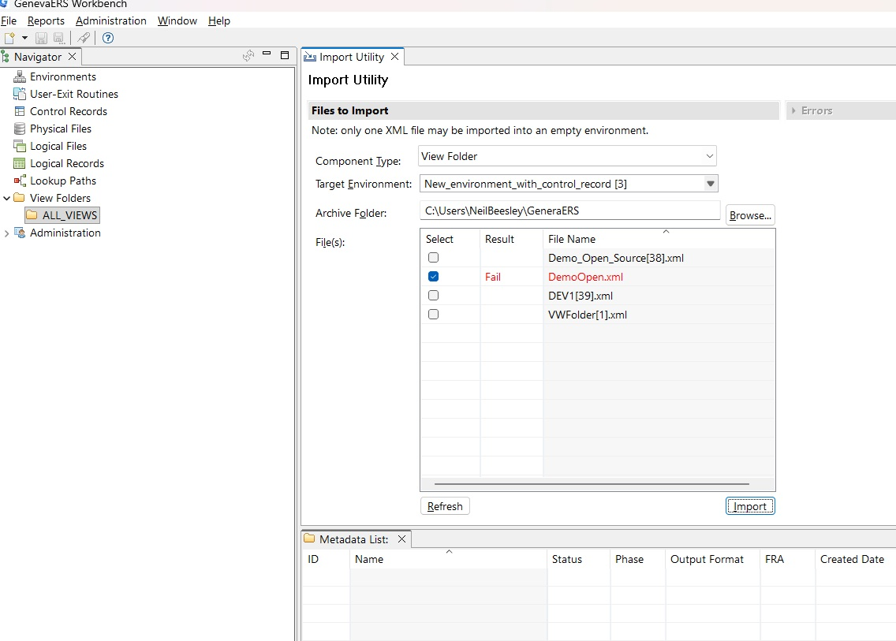

# How to define a DB2 Database for GenevaERS

This is intended for Db2 running z/OS at DB2 version 11 and above. These instructions provide a procedure used to define a new DB2 schema to contain GenevaERS metadata. In addition there is an alternative procedure to create a new DB2 schema with the purpose of replicating an existing GenevaERS environment to the new DB2 schema.

## Summary of steps involved
<pre>
1) clone database/db2 directory contents to USS
2) prepare your site db2 defaults to use with GenevaERS
3) copy JCL, DDL SQL to MVS datasets with your site defaults
4) build DB2 Schema that is going to contain new GenevaERS data, or
5) Alternatively, replicate an existing GenevaERS environment into a new DB2 schema
</pre>
## Clone database/db2 directory contents to IBM USS

Logon to USS and using the bash shell enter one of the following commands, depending whether you are using ssh or https:
<pre>
git clone git@github.com:genevaers/Workbench.git
</pre>

<pre>
git clone https://github.com/genevaers/Workbench.git
</pre>

Then "cd" to the directory: database/db2/

## Prepare your site DB2 defaults

Either using TSO option 3.17 or the "vi" editor open file GetMetaData.sh under directory database/db2/

Locate the relevant section of the file and replace the following with your site defaults. You may eventually want more than one DB2 schemas so repeat the process with different target datasets in each case.
<pre>
export GERS_DB2_DBUSER=your-RACFID-for-DB2-administration
export GERS_DB2_DBNAME=your-db2-8-character-database-name
export GERS_DB2_STGGRP=your-db2-8-character-storage-group
export GERS_DB2_DBSCH=your-db2-8-character-schema
export GERS_DB2_SUBSYSTEM=your-db2-4-character-subsystem
export GERS_DB2_PLAN=your-DB2-administration-plan-used
export GERS_DB2_PROCLIB=your-DB2-proclib
export GERS_DB2_RUN_LIB=your-DB2-runlib
export GERS_DB2_LOAD_LIB=your-DB2-loadlib
export GERS_DB2_EXIT_LIB=your-DB2-exit-lib
export GERS_JOB_CLASS=your-job-class
export GERS_JOB_MSG_CLASS=your-msg-class
export GERS_SCEERUN=your-CEE.SCEERUN
export GERS_SCEERUN2=your-CEE.SCEERUN2
export GERS_SCBCDLL=your-CBC.SCLBDLL
export GERS_TO_PDS_HLQ=your-pds-hlq
export GERS_TO_PDS_MLQ=your-pds-mlq
</pre>
The following environment variables are needed in addition if you are replicating an existing GenevaERS environment to a new DB2 schema.
<pre>
export GERS_FROM_PDS_HLQ=your-unload-dataset-hlq
export GERS_FROM_PDS_MLQ=your-unload-dadaset-mlq
export GERS_FROM_DB2_DBUSER=your-from-database-user
export GERS_FROM_DB2_DBNAME=your-from-database-name
export GERS_FROM_DB2_DBSG=your-from-database-storage-group
export GERS_FROM_DB2_DBSCH=your-from-database-schema
export GERS_FROM_DB2_DBSUB=your-from-database-subsystem
</pre>
The following variables are for running an optional smoke test of RCA and Performance engine with DB2
<pre>
export GERS_ENV_HLQ=same-as-GERS_ENV_HLQ-in-.gers.profile
export GERS_DEMO_HLQ=your-GVBDEMO-hlq
export GERS_DEMO_MLQ=your GVBDEMO-mlq
export GERS_JVM_PROC_LIB='AJV.V11R0M0.PROCLIB';
export GERS_JZOS_LOAD_LIB='AJV.V11R0M0.SIEALNKE';
export GERS_DB2_HOST=host-name-DB2-database
export GERS_DB2_PORT=port-number-DB2-database
export GERS_DB2_SAFR_ENV='1';
export GERS_JAVA_HOME="/Java/J17.0_64"
export GERS_RCA_JAR_DIR=same-as-GERS_RCA_JAR_DIR-in-.gers.profile
</pre>

## Copy JCL, DDL and JCL to MVS PDS[E] dataset

Logon to TSO and copy the following JCL into an existing jobs library, using your own jobcard. Ensure you set the HLQ and MLQ symbolics as you require:

<pre>
//*   .   ensure variables are exportable
//*
//         EXPORT SYMLIST=*
//*
//         SET HLQ=GENEVA
//         SET MLQ=MIDDLE
//* 
//*   .   Delete any prior existing datasets
//*
//DELETE     EXEC   PGM=IDCAMS
//SYSPRINT   DD     SYSOUT=*
//SYSIN      DD *,SYMBOLS=EXECSYS
 DELETE &HLQ..&MLQ..JCL
 IF LASTCC > 0 THEN
   SET MAXCC = 0
 DELETE &HLQ..&MLQ..DDL
 IF LASTCC > 0 THEN
   SET MAXCC = 0
 DELETE &HLQ..&MLQ..SQL
 IF LASTCC > 0 THEN
   SET MAXCC = 0
//*
//*   .   Allocate datasets
//* 
//ALLOC    EXEC PGM=IEFBR14,
//            COND=(0,LT)
//SYSPRINT DD SYSOUT=* 
//DBRMJCL  DD DSN=&HLQ..&MLQ..JCL,
//            DISP=(NEW,CATLG,DELETE),
//            UNIT=SYSDA,DSNTYPE=LIBRARY,
//            SPACE=(TRK,(10,10),RLSE),
//            DSORG=PO,RECFM=FB,LRECL=80
//DBRMDDL  DD DSN=&HLQ..&MLQ..DDL,
//            DISP=(NEW,CATLG,DELETE),
//            UNIT=SYSDA,DSNTYPE=LIBRARY,
//            SPACE=(TRK,(10,10),RLSE),
//            DSORG=PO,RECFM=FB,LRECL=80
//DBRMSQL  DD DSN=&HLQ..&MLQ..SQL,
//            DISP=(NEW,CATLG,DELETE),
//            UNIT=SYSDA,DSNTYPE=LIBRARY,
//            SPACE=(TRK,(10,10),RLSE),
//            DSORG=PO,RECFM=FB,LRECL=80
</pre>
To copy the information to your newly allocated MVS datasets type the following in USS:
<pre>
./MakeDB2Schema.sh
</pre>
## Build DB2 Schema to contain GenevaERS objects
First we'll cover building a new GenevaERS environment. A later section deals with an alternative process for replicating a GenevaERS environment.

<pre>
DROPALL  - drop existing database schema if it exists
BLDDB01  - create database, C_*, E_* and X_* tables
BLDDB02  - create Logic Table/LOB column
BLDDB03  - create C_*, E_* and X_* indexes
BLDDB04  - create foreign keys
BLDDB05  - load CODETABL and the other table
BLDDB06  - create DB2 views
REPAIR   - remove tablespaces check pending status
INSTSP   - install stored procedures
</pre>

## Build schema and replicate an existing GenevaERS environment and objects

This process is distinct to the one above for creating an empty DB2 schema. It replicates a GenevaERS environment, populating it with data from an existing environment. It comprises creating a DB2 schema and loading the data.
<pre>
UNLOAD   - unload GenevaERS data from existing DB2 schema             - Todo
EXDSNMOD - change LOB file location                                   - Todo
EXMPNC2  - change schema                                              - Todo
DROPALL  - drop existing database schema if it exists
BLDDB01  - create database, C_*, E_* and X_* tables
BLDDB02  - create Logic Table/LOB column
BLDDB03  - create C_*, E_* and X_* indexes
LOAD01   - load database without E_LOGIC table                         - Todo
LOAD02   - load E_LOGIC table                                          - Todo
BLDDB04  - create foreign keys
BLDDB06  - create DB2 views
REPAIR   - remove tablespaces check pending status
INSTSP   - install stored procedures
</pre>

## Importing XML into DB2 Schema

The following scenarios are provided to demonstrate re-importing exported Workbench views along with all their constituent parts into a DB2 schema

### Importing to an empty DB2 schema containing an environment with no existing Workbench metadata

If a DB2 schema is completely empty, such as in the case above (see **Build DB2 Schema to contain GenevaERS objects**) it will contain a single *environment* named Development. This default environment is installed by the process described above. You can import an XMLformat view folder such as Demo_Open_Source.XML into this view folder as is, see the following screenshot.

Also included in the prepared JCL are the jobs for running the views in **Demo_Open_Source**. These jobs read the GenevaERS metadata directly from the DB2 database -- so are able to perform an optional smoke test of the defined DB2 schema.

<pre>
GVBDEME.JCL     Runs RCA and Performance Engine
GVBDEMF1.JCL    Runs subsequest format job
GVBDEMF2.JCL    Runs subsequest format job
GVBDEMF3.JCL    Runs subsequest format job
</pre>

### Importing to a DB2 schema which contains existing Workbench views

You cannot import an XMLformat view folder into an environment containing existing Workbench objects. Therefore a new *environment* must be created for the import to work. Under Administration select New Environment. In order to avoid a clash of Control Records it is recommended you un-tick the box that says **Generate a Control Record** before proceeding. See the screenshot below.

### Avoiding a clash in the control record

If you encounter the following problem, see screen shot, it means there is a conflicting control record already in the empty environment you are trying to use for the import. Therefore you must first create an empty environment using the option to not create a control record.

### Note on stored procedures - job INSTSP

Stored Procedures are used by the GENEVA Workbench to access
related metadata in the DB2 database. These native Stored
Procedures so must use DB2 Z/OS Version 11 or above.

Native stored procedures are created directly in DB2.

